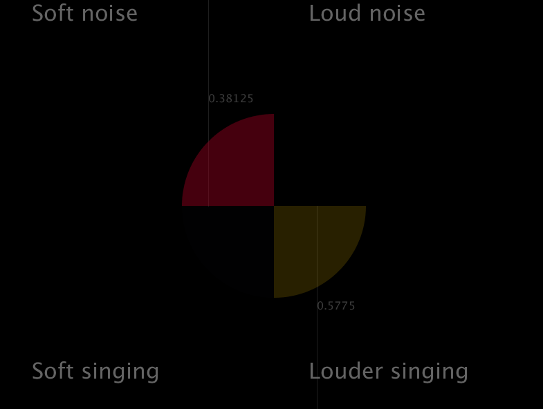
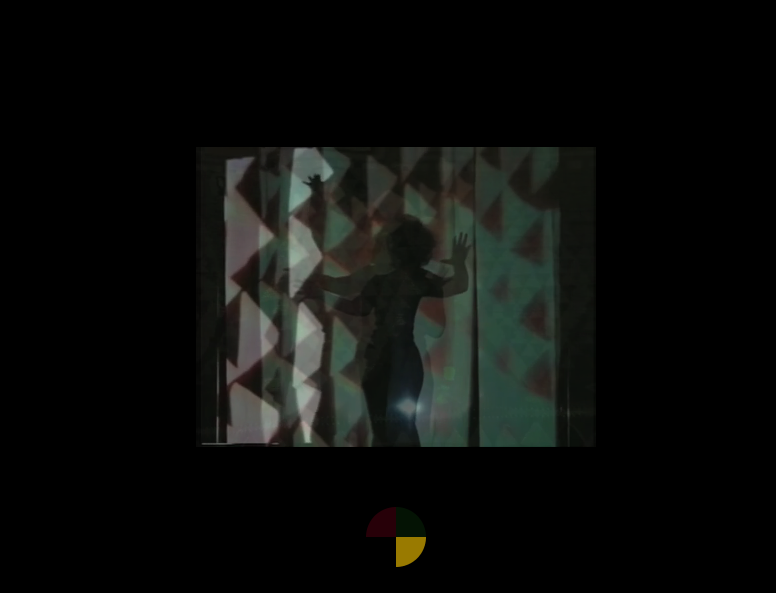

# hammani_project
Interactive video installation for Myriam Hammani.

## Overview
The video player is handled by a Processing script, and the audio part is handled by SuperCollider script. They communicate via OSC messages.

- The main script for the video is "videoPlayer.pde", located in the "videoPlayer" folder.
- The main script for the audio processing is "vocalAnalysis.scd"

## Installation
1) install [Processing](https://processing.org/) and [SuperCollider](https://supercollider.github.io/download)
2) in Processing, install the video and OSCP5 libraries:
  - menu Sketch>Import Library... > Add Library
  - type "video" in the search field, and install.
  - type "OSCP5" in the search field, and install.

## Video configuration
The video file you want to play needs to be copied inside the "data" folder (itself inside the "videoPlayer" folder.)

In our tests, .mov and .mp4 formats will work, but the preferred encoding is *h264*. Be sure to export your video to this format in case you can't play the video.

There are a couple edits you need to make in the "videoPlayer.pde" file to play your video:

1. the filename of the video should match with the name in the code. By default, it is set to "video.mp4". If your video has a different name, either change it to "video.mp4" or edit the code to match your file's name. The line to edit is around line 66 in videoPlayer.pde:

```java

  for (int i = 0; i<4; i++) {
    movies[i] = new Movie(this, "video.mp4");
    movies[i].noLoop();
  }
```

  For instance, if your video is called "one_flew_over_a_cuckoos_nest.mp4", change the above code to:

  ```java

    for (int i = 0; i<4; i++) {
      movies[i] = new Movie(this, "one_flew_over_a_cuckoos_nest.mp4");
      movies[i].noLoop();
    }
  ```

>Avoid spaces or accents, quotes etc in your file name.

2. The installation allows to play 4 different sections of the video. These sections are defined by the ```sectionStarts``` and ```sectionEnds``` numbers in the script:

```java
// These are the 4 sections START times, in seconds.
// Edit to your needs, but make sure to keep the values within the bounds of your video duration.
float[] sectionStarts = { 0, 15, 30, 45};

// These are the 4 sections END times, in seconds.
// Edit to your needs, but make sure to keep the values within the bounds of your video duration.
float[] sectionEnds = { 15, 30, 45, 53};
```
Edit these values to define the 4 sections of the video, that correspond to the 4 audio categories detected from the vocal input.


Once this is done, you're all set on the video player side.

## Audio configuration
You should have an audio interface with input and output. Configure SuperCollider to select the right input/outputs with your hardware. By default these probably match the ones for your system. This configuration is beyond the scope of this documentation as it depends on your system.

1. In SuperCollider, open the main script "vocalAnalysis.scd".
2. Go to the Language menu, and select "evaluate file": this run the script (which also starts the SuperCollider audio server).

In the post window of SuperCollider, you should see lists of numbers, like this:

```
------------
[ 0, 0, 0.14, 0 ]
Category: 2
------------
[ 0, 0, 0.12, 0 ]
Category: 2
------------
```

These indicate in real time the likelihood of each of the 4 audio categories, in real time. The category with the highest likelihood is printed out beneath it (numbered from 0). In the above example, the third category has the highest value, so the picked category is 2.
These likelihood values are sent to the video player, and used to control the playback and opacity of each video of the 4 categories.

## Interacting with the Installation
The videoPlayer has 2 screens. You can toggle between them by hitting the space bar.

### Practice screen
The first one is used to practice and calibrate the audio analysis. It's a quadrant with the 4 audio categories. There are 2 sliders you can play with to calibrate the audio analysis. The one on top is the threshold for distinguishing soft noise from loud noise. The more you push this slider to the right, the more you will need to be loud to trigger the loud noise category. And vice versa. The same principle applies for the bottom slider: it's a threshold for distinguishing between soft and loud singing.

> In this case, "noise" means a sound without a tone. For instance, a "shhhh" sound is a noise. But singing random short notes, or screaming, can have a tone and thus will be categorised as singing.

> also, there is some amount of low pass filtering applied to the analysis so that it is not too "jumpy". So you need to keep going in the same category  for a few seconds before your category actually gets triggered. This inertia is there by design, not a bug.




### Play screen
The play screen allows to navigate in the videos, using the vocal input. There can be 2 videos playing at the same time, if the audio analysis has 2 categories highlighted at the same time. If you keep going in the same category with your voice, you should be able to play only one video at a time, and the others will fade out. If you reactivate a category, the corresponding video section will resume where it left off.



